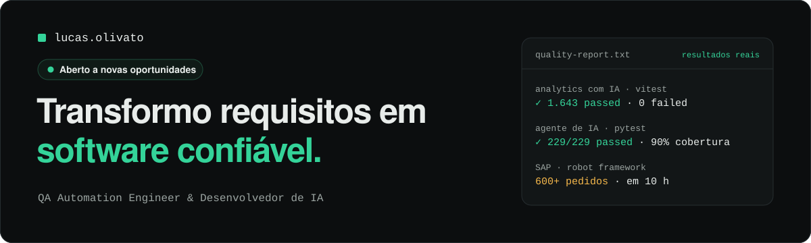

<a href="https://www.lucasolivato.com">
  
</a>

<br>

Sou **QA Automation Engineer & Desenvolvedor de IA**: trabalho dos dois lados do código, escrevendo os testes e também construindo o que eles validam. Meu diferencial é levar o olhar de QA para dentro do desenvolvimento — pensar em risco, regra de negócio e regressão desde a primeira linha.

[](https://www.lucasolivato.com)
[](https://www.linkedin.com/in/lucas-olivato/)
[](mailto:lucasolivato@gmail.com)
[-34D399?style=flat-square)](https://www.lucasolivato.com/Curriculo_Lucas_Olivato.pdf)

### `// agora`

- **Agentes de IA na NuageIT** — em junho de 2026 migrei de QA para desenvolvimento. Desde então, crio agentes com LLMs para clientes: construo e testo assistentes que respondem perguntas dentro de um contexto: um agente conversacional serverless na AWS, com guardrails contra prompt injection, e um assistente de analytics que responde apenas com dados reais do banco, sem inventar números.
- **[VORCQ](https://www.lucasolivato.com/work/vorcq)** — sistema de gestão de uma locadora de caçambas, em produção: regras de negócio no banco, trilha de auditoria, três perfis de acesso e quality gates a cada entrega.
- **ClinicFlow** — CRM SaaS multi-tenant para clínicas médicas e odontológicas, com atendimento via WhatsApp e automações com IA.
- **[lucasolivato.com](https://github.com/Lucasolivato/lucasolivato-portfolio)** — meu portfólio, tratado como produto: 74 testes com Playwright e axe rodando no GitHub Actions.

### `// resultados`

| Resultado | Onde |
|---|---|
| **1.643 testes** | aprovados, 0 falhas, no assistente de IA para analytics |
| **229/229** | testes unitários e 90% de cobertura no backend do agente de IA na AWS |
| **38/38** | asserções E2E executadas no ambiente real da AWS |
| **600+ pedidos** | criados em 10 horas com Robot Framework para destravar um teste de carga em SAP |
| **232 commits** | e 184 arquivos de teste no VORCQ, em menos de um mês |

Estudos de caso completos: [VORCQ](https://www.lucasolivato.com/work/vorcq) · [automação em SAP](https://www.lucasolivato.com/work/sap-automation) · [qualidade no portfólio](https://www.lucasolivato.com/work/portfolio-automation)

### `// ferramentas`

**Qualidade e automação**<br>


**Desenvolvimento**<br>


**Dados e entrega**<br>


### `// trajetória`

```
jun/2026 — hoje   NuageIT            Desenvolvedor · agentes de IA e LLMs
2025 — jun/2026   NuageIT            Analista de Qualidade de Software
2023 — 2025       Tecnologia Única   QA · Robot Framework, Selenium, Python e SAP
2010 — 2020       área técnica       energia solar e eletrônica
formação          Gestão de TI (Fatec Jaú) · Técnico em Desenvolvimento de Sistemas (Etec)
```

> A maior parte do meu trabalho está em repositórios privados, porque atende clientes reais. Os estudos de caso no portfólio contam o que construí e como testei — e posso mostrar o código em uma conversa técnica.

<br>

<picture>
  <source media="(prefers-color-scheme: dark)" srcset="https://raw.githubusercontent.com/Lucasolivato/Lucasolivato/output/github-contribution-grid-snake-dark.svg">
  
</picture>
